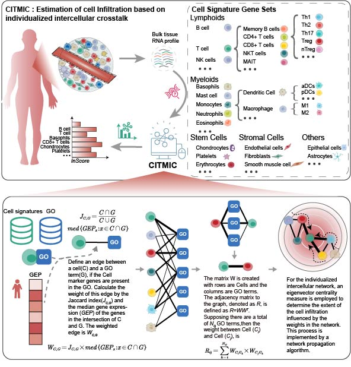

# CITMIC
[](https://github.com/zhaopapers/CITMIC)
[](https://www.repostatus.org/#wip)
[](https://www.gnu.org/licenses/old-licenses/gpl-2.0.en.html)
[](https://app.codacy.com/gh/randef1ned/labyrinth/dashboard?utm_source=gh&utm_medium=referral&utm_content=&utm_campaign=Badge_grade)
[](https://makeapullrequest.com)


CITMIC is a method for estimate cell infiltration score

##Introduction

`CITMIC` can infer the cell infiltration of the TME by simultaneously measuring 86 different cell types, constructing an individualized cell-cell crosstalk network based on functional similarities between cells, and using only gene transcription data. This is a novel approach to estimate the relative cell infiltration levels, and which were shown to be superior to the current methods.



## A notice on operating system compatibility
- We recommend using as input the gene expression matrix normalized by log2(fpkm+1).
- If your computer has multiple CPU cores, we recommend that you select the number of cl.cores to apply to CITMIC based on `parallel::detectCores()`. He will greatly improve the efficiency of the function's operation.
- **R (≥ 4.2.0)**: We developed this R package using R version 4.3.x.
  

## Installation

Install `CITMIC` using:

``` r
install.packages(c('devtools', 'BiocManager'))
remotes::install_github("zhaopapers/CITMIC")
```

## Usage

Load the package using `library(CITMIC)`. We provide a vignette for the package that can be called using: `vignette("CITMIC")`. 
Alternatively, you can view the online version on [CRAN](doc/labyrinth_knit.md), The examples I provided would take several minutes to run on a normal desktop computer. Basically that is all you have to know.


